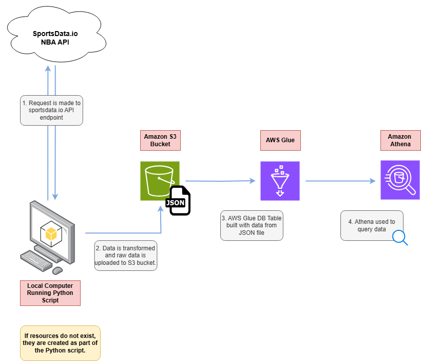

# NBA Analytics Data Lake
## Overview
This project is part of the NBA All Stars DevOps Challenge. This is the third project in the series and the original repository for this project was cloned from https://github.com/alahl1/NBADataLake. \
\
This project uses the sportsdata.io NBA API to get a list of NBA players. This information is then saved to Amazon S3, transformed into a Amazon Glue Database and is then used in AWS Athena to generate queries.\
\
For the most part, this project was followed hand-in-hand with the demonstration video except I decided to execute the code in a local environment instead of utilizing the AWS Cloud Shell. The tutorial video can be found here: https://www.youtube.com/watch?si=G3byNMhZQtcf58lx&v=RAkMac2QgjM&feature=youtu.be
## Prerequisites
To complete this project, the following prerequisites are needed:
- AWS Account
- Sportsdata.io NBA API Key
## Technologies
The following services were used to complete this project:
- **Cloud Provider:** Amazon Web Services
- **AWS Services:** Amazon S3, AWS Glue, AWS Athena
- **External API:** Sportsdata.io NBA API
- **Programming Language:** Python
## Technical Architecture

## Project Flow
To complete this project, you will need an AWS account and a sportsdata.io NBA API Key.\
\
This script can be run in the AWS Cloud Shell or in a local environment. I opted to run this script from my local computer in Visual Studio Code.\
\
The **set_up_nba_data_lake.py** file is the **all star** of the show. 

1.	The Amazon S3 bucket used to store json data is created with the specified name in the specified AWS region. If the S3 bucket already exists, you will receive a message sating so and the code will proceed. When running the script file locally. I received a LocationConstraint error message when using an if/else block. I removed the if/else block and was able to successfully create the S3 bucket in my account.
2.	With the S3 bucket created, the AWS Glue Database is then created.
3.	A request is made to the sportsdata.io NBA API endpoint for a list of all current NBA players. That data is then uploaded to the S3 bucket that was created in the first step as a JSON file.
4.	A Glue Database table is created is then created from the JSON file saved to the S3 bucket.
5.	AWS Athena is configured. After Athena was configured, I ran a few queries on the NBA Players table to verify that data was being returned successfully. Here is an example of a query I ran: ***select playerid, firstname from nba_players where lastname like ‘James’***. In the screenshots section, I uploaded a picture of the data returned when running the query.
## Clean Up
After you are finished working in AWS, you can run the **delete_aws_resources.py** script to clean up any resources that were created as part of this project. The screenshots section has a screenshot of the output that is displayed when the script is ran.\
\
Alternatively, you can log into the AWS Console and delete the resources manually.\
## Screen Shots
\
*Created S3 Bucket*\
\
\
*JSON file created inside of S3 Bucket*\
\
\
*Glue Databases*\
\
\
*Query in Athena*\
\
\
*Cleanup*